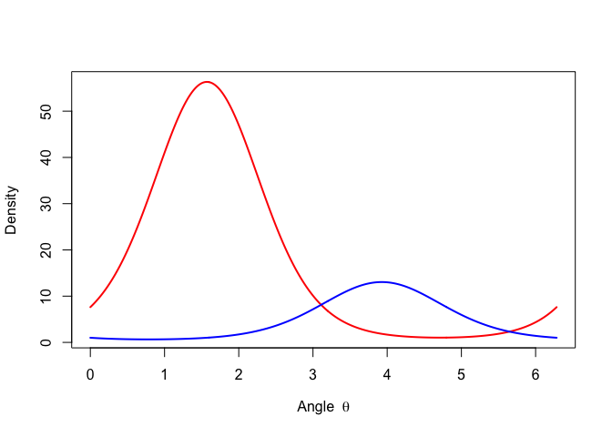
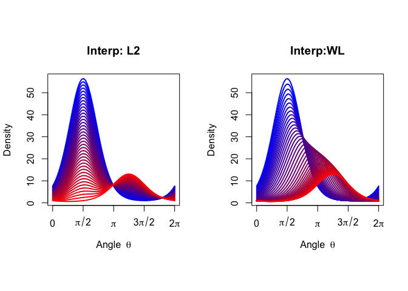

# Interpolation of vMF Distributions
Kisung You

- [Setup](#setup)
- [Two Densities](#two-densities)
- [Computation](#computation)
- [Visualize](#visualize)

## Setup

A major difference between the standard $L_2$ structure and the proposed
$\mathcal{WL}$ geometry is how we formalize *difference* between two vMF
distributions. For such, we will consider two vMF distributions on
$\mathbb{S}^1 \subset \mathbb{R}^2$ and compare how they differ when
interpolating two densities. We need
[maotai](https://cran.r-project.org/package=maotai) package as well as
some helper routines available, which can be loaded as follows.

``` r
# Load packages
library(pacman)
pacman::p_load(maotai)

# Helper functions
source("auxiliary.R")
```

## Two Densities

Now, we define two densities that are distinct. Let’s check their means
and concentrations are distinct enough. Since the distributions are
defined on $\mathbb{S}^1$, we will visualize them not on the unit circle
but with the angle $\theta \in [0, 2\pi)$.

``` r
# angles and concentrations
theta1 <- (2 / 4) * pi
theta2 <- (2 - 3 / 4) * pi
kappa1 <- 2
kappa2 <- 1.5

# mean directions
mu1 <- c(cos(theta1), sin(theta1))
mu2 <- c(cos(theta2), sin(theta2))

# grid
vec_theta <- seq(0, 2 * pi, length.out = 500)

# densities
density1 <- aux_density(vec_theta, mu1, kappa1)
density2 <- aux_density(vec_theta, mu2, kappa2)

plot(
  vec_theta, density1, type = "l", col = "red", lwd = 2,
  xlab = expression("Angle " ~ theta),
  ylab = "Density"
)
lines(vec_theta, density2, col = "blue", lwd = 2)
```



Before moving further, let’s set some common visualization settings.

``` r
# number of interpolation steps
n_scale <- 40

# color scale
color_scale <- colorRampPalette(c("blue", "red"))(n_scale)

# storage
densities_vert <- vector("list", n_scale)
densities_wass <- vector("list", n_scale)

# boundary conditions
densities_vert[[1]] <- density1
densities_vert[[n_scale]] <- density2
densities_wass[[1]] <- density1
densities_wass[[n_scale]] <- density2

# weights
vec_weights <- seq(0, 1, length.out = n_scale)

# axis formatting
ticks  <- c(0, pi/2, pi, 3*pi/2, 2*pi)
labels <- expression(0, pi/2, pi, 3*pi/2, 2*pi)
```

## Computation

Now, we compute $L_2$-based and $\mathcal{WL}$-based interpolations at
once.

``` r
# vertical interpolation via L2
for (i in 2:(n_scale - 1)) {
  densities_vert[[i]] <-
    vec_weights[i] * density2 +
    (1 - vec_weights[i]) * density1
}

# horizontal interpolation via WL
for (i in 2:(n_scale - 1)) {

  tmp <- maotai::WLbarycenter(
    rbind(mu1, mu2),
    c(kappa1, kappa2),
    c(1 - vec_weights[i], vec_weights[i])
  )

  densities_wass[[i]] <-
    aux_density(vec_theta, tmp$mean, tmp$concentration)
}
```

## Visualize

Finally, let’s graphically compare two interpolations.

``` r
par(mfrow=c(1,2), pty='s')

# interpolation via L2
plot(
  vec_theta, densities_vert[[1]],
  type = "l", col = color_scale[1], lwd = 2,
  xaxt = "n", yaxt = "n",
  xlab = expression("Angle " ~ theta),
  ylab = "Density", 
  main = "Interp: L2"
)
axis(1, at = ticks, labels = labels)
axis(2)

for (i in 2:n_scale) {
  lines(vec_theta, densities_vert[[i]],
        col = color_scale[i], lwd = 2)
}

# interpolation via WL
plot(
  vec_theta, densities_wass[[1]],
  type = "l", col = color_scale[1], lwd = 2,
  xaxt = "n", yaxt = "n",
  xlab = expression("Angle " ~ theta),
  ylab = "Density",
  main = "Interp:WL"
)
axis(1, at = ticks, labels = labels)
axis(2)

for (i in 2:n_scale) {
  lines(vec_theta, densities_wass[[i]],
        col = color_scale[i], lwd = 2)
}
```


