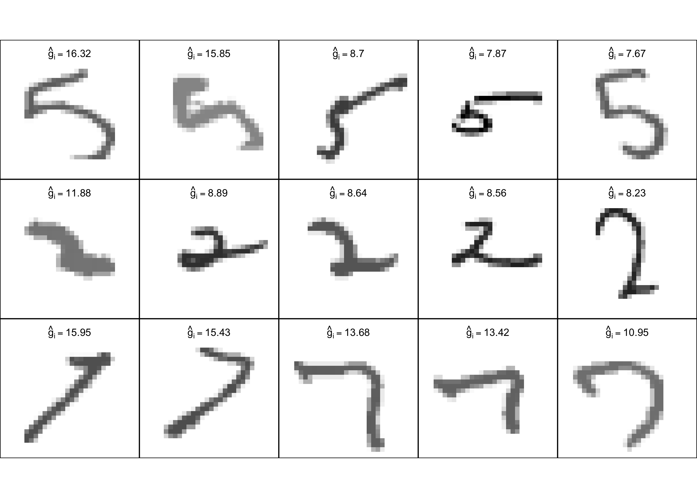

# Example: MNIST Digits
Kisung You

- [Introduction](#introduction)
- [Run the digit-wise analysis](#run-the-digit-wise-analysis)
- [Within-digit heterogeneity table](#within-digit-heterogeneity-table)
- [Pairwise comparisons](#pairwise-comparisons)
- [Eccentric observations](#eccentric-observations)
- [Visualizing eccentric images](#visualizing-eccentric-images)
- [Summary](#summary)

### Introduction

This notebook reproduces the MNIST illustration used in the manuscript.
For each digit, we work with a sample of 500 images and the
corresponding within-digit pairwise Wasserstein distances. The goal is
to estimate within-class heterogeneity, compare the digit classes, and
identify the images with the largest empirical eccentricities.

``` r
rm(list = ls())

library(ggplot2)
library(patchwork)
library(grid)

source("src.R")
```

### Run the digit-wise analysis

We first compute the proposed heterogeneity summaries for the ten digit
classes. The analysis uses the squared transform ((t)=t^2), along with
the corresponding standard errors and Wald intervals.

``` r
results <- analyse_mnist_digits(
  data_dir = file.path(getwd(), "data", "distances"),
  digits = 0:9,
  distance_is_squared = FALSE,
  main_transform = "squared",
  do_bounded_sensitivity = TRUE,
  bounded_c0_rule = "global_median",
  alpha = 0.05,
  D0 = 0,
  top_k = 12
)
```

### Within-digit heterogeneity table

The main output is the within-digit summary table. It reports the
heterogeneity estimate, its standard error, the 95% confidence interval,
and the induced rank across digits.

``` r
results$summary
```

         n estimate sigma2_hat        se ci_lower  ci_upper null_value  z_value
    1  500 4.938938   7.816764 0.1250341 4.693876  5.184001          0 39.50073
    2  500 5.915815  36.948783 0.2718411 5.383017  6.448614          0 21.76204
    3  500 9.241062  20.537776 0.2026710 8.843834  9.638290          0 45.59636
    4  500 8.027784  23.340272 0.2160568 7.604320  8.451247          0 37.15589
    5  500 7.827978  18.825593 0.1940391 7.447668  8.208288          0 40.34226
    6  500 9.600580  24.863024 0.2229934 9.163521 10.037639          0 43.05321
    7  500 6.742581  18.494267 0.1923240 6.365633  7.119530          0 35.05844
    8  500 8.787558  36.545042 0.2703518 8.257679  9.317438          0 32.50416
    9  500 6.493200  18.120061 0.1903684 6.120085  6.866315          0 34.10860
    10 500 6.526096  20.714034 0.2035389 6.127167  6.925025          0 32.06314
             p_value digit transform c0 rank_desc rank_asc
    1   0.000000e+00     0   squared NA        10        1
    2  5.313519e-105     1   squared NA         9        2
    3   0.000000e+00     2   squared NA         2        9
    4  3.521445e-302     3   squared NA         4        7
    5   0.000000e+00     4   squared NA         5        6
    6   0.000000e+00     5   squared NA         1       10
    7  2.899448e-269     6   squared NA         6        5
    8  9.312158e-232     7   squared NA         3        8
    9  5.499044e-255     8   squared NA         8        3
    10 1.439897e-225     9   squared NA         7        4

For convenience, the digits ranked from most to least heterogeneous are
shown below.

``` r
results$summary[order(-results$summary$estimate), ]
```

         n estimate sigma2_hat        se ci_lower  ci_upper null_value  z_value
    6  500 9.600580  24.863024 0.2229934 9.163521 10.037639          0 43.05321
    3  500 9.241062  20.537776 0.2026710 8.843834  9.638290          0 45.59636
    8  500 8.787558  36.545042 0.2703518 8.257679  9.317438          0 32.50416
    4  500 8.027784  23.340272 0.2160568 7.604320  8.451247          0 37.15589
    5  500 7.827978  18.825593 0.1940391 7.447668  8.208288          0 40.34226
    7  500 6.742581  18.494267 0.1923240 6.365633  7.119530          0 35.05844
    10 500 6.526096  20.714034 0.2035389 6.127167  6.925025          0 32.06314
    9  500 6.493200  18.120061 0.1903684 6.120085  6.866315          0 34.10860
    2  500 5.915815  36.948783 0.2718411 5.383017  6.448614          0 21.76204
    1  500 4.938938   7.816764 0.1250341 4.693876  5.184001          0 39.50073
             p_value digit transform c0 rank_desc rank_asc
    6   0.000000e+00     5   squared NA         1       10
    3   0.000000e+00     2   squared NA         2        9
    8  9.312158e-232     7   squared NA         3        8
    4  3.521445e-302     3   squared NA         4        7
    5   0.000000e+00     4   squared NA         5        6
    7  2.899448e-269     6   squared NA         6        5
    10 1.439897e-225     9   squared NA         7        4
    9  5.499044e-255     8   squared NA         8        3
    2  5.313519e-105     1   squared NA         9        2
    1   0.000000e+00     0   squared NA        10        1

These results should reproduce the main pattern reported in the
manuscript: digits such as 5, 2, and 7 are more heterogeneous, whereas
digits such as 0 and 1 are comparatively stable

### Pairwise comparisons

We also compare digit classes pairwise using the two-sample statistic.

``` r
results$pairwise[order(results$pairwise$p_value_bh), ]
```

       digit_A digit_B estimate_A estimate_B estimate_diff   se_diff   ci_lower
    5        0       5   4.938938   9.600580   -4.66164174 0.2556552 -5.1627167
    2        0       2   4.938938   9.241062   -4.30212352 0.2381367 -4.7688628
    7        0       7   4.938938   8.787558   -3.84862012 0.2978651 -4.4324250
    4        0       4   4.938938   7.827978   -2.88903959 0.2308348 -3.3414675
    3        0       3   4.938938   8.027784   -3.08884534 0.2496279 -3.5781070
    38       5       8   9.600580   6.493200    3.10738025 0.2931999  2.5327190
    13       1       5   5.915815   9.600580   -3.68476472 0.3516015 -4.3738910
    39       5       9   9.600580   6.526096    3.07448412 0.3019174  2.4827369
    23       2       8   9.241062   6.493200    2.74786203 0.2780570  2.2028804
    10       1       2   5.915815   9.241062   -3.32524650 0.3390769 -3.9898249
    36       5       6   9.600580   6.742581    2.85799859 0.2944734  2.2808413
    24       2       9   9.241062   6.526096    2.71496590 0.2872344  2.1519968
    21       2       6   9.241062   6.742581    2.49848037 0.2793995  1.9508674
    6        0       6   4.938938   6.742581   -1.80364315 0.2293950 -2.2532491
    15       1       7   5.915815   8.787558   -2.87174310 0.3833897 -3.6231731
    43       7       8   8.787558   6.493200    2.29435863 0.3306512  1.6462942
    8        0       8   4.938938   6.493200   -1.55426149 0.2277579 -2.0006587
    44       7       9   8.787558   6.526096    2.26146250 0.3384053  1.5982003
    9        0       9   4.938938   6.526096   -1.58715762 0.2388757 -2.0553454
    40       6       7   6.742581   8.787558   -2.04497697 0.3317810 -2.6952557
    11       1       3   5.915815   8.027784   -2.11196833 0.3472436 -2.7925533
    31       4       5   7.827978   9.600580   -1.77260215 0.2955964 -2.3519605
    12       1       4   5.915815   7.827978   -1.91216257 0.3339891 -2.5667693
    29       3       8   8.027784   6.493200    1.53458386 0.2879595  0.9701936
    26       3       5   8.027784   9.600580   -1.57279639 0.3104941 -2.1813537
    30       3       9   8.027784   6.526096    1.50168772 0.2968310  0.9199098
    19       2       4   9.241062   7.827978    1.41308393 0.2805829  0.8631516
    34       4       8   7.827978   6.493200    1.33477810 0.2718296  0.8020020
    35       4       9   7.827978   6.526096    1.30188197 0.2812103  0.7507198
    27       3       6   8.027784   6.742581    1.28520220 0.2892561  0.7182707
    18       2       3   9.241062   8.027784    1.21327818 0.2962366  0.6326652
    32       4       6   7.827978   6.742581    1.08539644 0.2732027  0.5499290
    1        0       1   4.938938   5.915815   -0.97687702 0.2992175 -1.5633325
    33       4       7   7.827978   8.787558   -0.95958053 0.3327781 -1.6118136
    14       1       6   5.915815   6.742581   -0.82676613 0.3329956 -1.4794256
    37       5       7   9.600580   8.787558    0.81302162 0.3504513  0.1261496
    28       3       7   8.027784   8.787558   -0.75977477 0.3460789 -1.4380770
    17       1       9   5.915815   6.526096   -0.61028060 0.3395963 -1.2758771
    16       1       8   5.915815   6.493200   -0.57738447 0.3318700 -1.2278377
    22       2       7   9.241062   8.787558    0.45350340 0.3378841 -0.2087372
    20       2       5   9.241062   9.600580   -0.35951821 0.3013330 -0.9501201
    41       6       8   6.742581   6.493200    0.24938166 0.2706079 -0.2810002
    42       6       9   6.742581   6.526096    0.21648553 0.2800296 -0.3323625
    25       3       4   8.027784   7.827978    0.19980576 0.2903993 -0.3693663
    45       8       9   6.493200   6.526096   -0.03289613 0.2786901 -0.5791188
          ci_upper null_value     z_value      p_value   p_value_bh
    5  -4.16056677          0 -18.2340979 2.767832e-74 1.245525e-72
    2  -3.83538420          0 -18.0657740 5.928461e-73 1.333904e-71
    7  -3.26481527          0 -12.9206820 3.440780e-38 5.161170e-37
    4  -2.43661166          0 -12.5156145 6.133138e-36 6.899780e-35
    3  -2.59958372          0 -12.3738002 3.622673e-35 3.260405e-34
    38  3.68204145          0  10.5981634 3.038893e-26 2.279169e-25
    13 -2.99563844          0 -10.4799460 1.068047e-25 6.866018e-25
    39  3.66623135          0  10.1831962 2.356903e-24 1.325758e-23
    23  3.29284366          0   9.8823709 4.964419e-23 2.482209e-22
    10 -2.66066806          0  -9.8067632 1.052918e-22 4.738131e-22
    36  3.43515584          0   9.7054559 2.857958e-22 1.169164e-21
    24  3.27793505          0   9.4520905 3.321299e-21 1.245487e-20
    21  3.04609335          0   8.9423219 3.810777e-19 1.319115e-18
    6  -1.35403723          0  -7.8626091 3.762136e-15 1.209258e-14
    15 -2.12031312          0  -7.4904026 6.866266e-14 2.059880e-13
    43  2.94242304          0   6.9389094 3.951383e-12 1.111327e-11
    8  -1.10786426          0  -6.8241833 8.842689e-12 2.340712e-11
    44  2.92472471          0   6.6827039 2.345732e-11 5.864329e-11
    9  -1.11896987          0  -6.6442827 3.046973e-11 7.216516e-11
    40 -1.39469819          0  -6.1636353 7.109357e-10 1.599605e-09
    11 -1.43138340          0  -6.0820945 1.186226e-09 2.541913e-09
    31 -1.19324384          0  -5.9966973 2.013709e-09 4.118951e-09
    12 -1.25755587          0  -5.7252236 1.032976e-08 2.021039e-08
    29  2.09897408          0   5.3291658 9.866488e-08 1.849966e-07
    26 -0.96423912          0  -5.0654629 4.074091e-07 7.291945e-07
    30  2.08346570          0   5.0590672 4.213124e-07 7.291945e-07
    19  1.96301622          0   5.0362448 4.747534e-07 7.912557e-07
    34  1.86755424          0   4.9103494 9.091424e-07 1.461122e-06
    35  1.85304410          0   4.6295665 3.664320e-06 5.686014e-06
    27  1.85213369          0   4.4431294 8.865979e-06 1.329897e-05
    18  1.79389116          0   4.0956396 4.210044e-05 6.111354e-05
    32  1.62086391          0   3.9728612 7.101443e-05 9.986405e-05
    1  -0.39042156          0  -3.2647727 1.095520e-03 1.493890e-03
    33 -0.30734742          0  -2.8835446 3.932269e-03 5.204474e-03
    14 -0.17410666          0  -2.4828136 1.303493e-02 1.675919e-02
    37  1.49989360          0   2.3199274 2.034481e-02 2.543101e-02
    28 -0.08147252          0  -2.1953800 2.813635e-02 3.421989e-02
    17  0.05531588          0  -1.7970768 7.232343e-02 8.564616e-02
    16  0.07306875          0  -1.7397912 8.189569e-02 9.449503e-02
    22  1.11574399          0   1.3421864 1.795355e-01 2.019775e-01
    20  0.23108369          0  -1.1930926 2.328331e-01 2.555485e-01
    41  0.77976347          0   0.9215608 3.567577e-01 3.822404e-01
    42  0.76533355          0   0.7730807 4.394746e-01 4.599153e-01
    25  0.76897784          0   0.6880381 4.914288e-01 5.025976e-01
    45  0.51332649          0  -0.1180384 9.060372e-01 9.060372e-01

The smallest adjusted $p$-value correspond to pairs of digits with the
most distinct levels of heterogeneity.

### Eccentric observations

We extract the most eccentric observations for each digit.

``` r
results$top_eccentric
```

        obs_index      ghat rank_desc rank_asc digit transform         which
    1         422  6.562493         1      500     0   squared top_eccentric
    2         225  5.188454         2      499     0   squared top_eccentric
    3         491  5.161598         3      498     0   squared top_eccentric
    4         364  5.106861         4      497     0   squared top_eccentric
    5         303  4.926669         5      496     0   squared top_eccentric
    6         445  4.623373         6      495     0   squared top_eccentric
    7         341  4.619697         7      494     0   squared top_eccentric
    8         450  4.552491         8      493     0   squared top_eccentric
    9          66  4.480076         9      492     0   squared top_eccentric
    10        402  4.118583        10      491     0   squared top_eccentric
    11        327  3.954283        11      490     0   squared top_eccentric
    12         21  3.841478        12      489     0   squared top_eccentric
    13        280 22.688664         1      500     1   squared top_eccentric
    14        452 14.889374         2      499     1   squared top_eccentric
    15        201 14.864725         3      498     1   squared top_eccentric
    16        347 14.107546         4      497     1   squared top_eccentric
    17        138 13.840035         5      496     1   squared top_eccentric
    18        249 13.714947         6      495     1   squared top_eccentric
    19         68 12.764062         7      494     1   squared top_eccentric
    20        206 11.902933         8      493     1   squared top_eccentric
    21        365 11.130115         9      492     1   squared top_eccentric
    22        380 10.018775        10      491     1   squared top_eccentric
    23        112  9.446940        11      490     1   squared top_eccentric
    24        250  8.878380        12      489     1   squared top_eccentric
    25        308 11.879242         1      500     2   squared top_eccentric
    26        319  8.892283         2      499     2   squared top_eccentric
    27        112  8.642637         3      498     2   squared top_eccentric
    28        456  8.555602         4      497     2   squared top_eccentric
    29        396  8.233674         5      496     2   squared top_eccentric
    30        196  8.050136         6      495     2   squared top_eccentric
    31         87  7.112185         7      494     2   squared top_eccentric
    32        484  6.832842         8      493     2   squared top_eccentric
    33        390  6.661717         9      492     2   squared top_eccentric
    34        360  6.259099        10      491     2   squared top_eccentric
    35        286  5.808220        11      490     2   squared top_eccentric
    36         29  5.740279        12      489     2   squared top_eccentric
    37        342 12.961282         1      500     3   squared top_eccentric
    38        285 12.386887         2      499     3   squared top_eccentric
    39        492 10.696386         3      498     3   squared top_eccentric
    40        319  8.854156         4      497     3   squared top_eccentric
    41         33  8.569480         5      496     3   squared top_eccentric
    42         19  8.138353         6      495     3   squared top_eccentric
    43         88  8.066892         7      494     3   squared top_eccentric
    44        463  7.947909         8      493     3   squared top_eccentric
    45         61  7.596417         9      492     3   squared top_eccentric
    46         80  7.321192        10      491     3   squared top_eccentric
    47         23  7.150479        11      490     3   squared top_eccentric
    48        286  7.118954        12      489     3   squared top_eccentric
    49        223 11.868999         1      500     4   squared top_eccentric
    50         83  8.680988         2      499     4   squared top_eccentric
    51        183  7.696885         3      498     4   squared top_eccentric
    52        151  7.473146         4      497     4   squared top_eccentric
    53        474  7.008402         5      496     4   squared top_eccentric
    54        249  6.666559         6      495     4   squared top_eccentric
    55        243  6.409296         7      494     4   squared top_eccentric
    56        134  6.345848         8      493     4   squared top_eccentric
    57        338  6.337064         9      492     4   squared top_eccentric
    58        276  5.741725        10      491     4   squared top_eccentric
    59        267  5.648846        11      490     4   squared top_eccentric
    60        419  5.583378        12      489     4   squared top_eccentric
    61        439 16.320762         1      500     5   squared top_eccentric
    62         82 15.850028         2      499     5   squared top_eccentric
    63         30  8.703138         3      498     5   squared top_eccentric
    64         51  7.866362         4      497     5   squared top_eccentric
    65        481  7.667529         5      496     5   squared top_eccentric
    66        105  7.582322         6      495     5   squared top_eccentric
    67        425  7.460705         7      494     5   squared top_eccentric
    68          5  6.958488         8      493     5   squared top_eccentric
    69        422  6.756775         9      492     5   squared top_eccentric
    70        405  6.626573        10      491     5   squared top_eccentric
    71        320  6.465325        11      490     5   squared top_eccentric
    72        495  6.406977        12      489     5   squared top_eccentric
    73        489 11.631451         1      500     6   squared top_eccentric
    74        166  9.664730         2      499     6   squared top_eccentric
    75         19  8.313311         3      498     6   squared top_eccentric
    76         46  7.734722         4      497     6   squared top_eccentric
    77         43  7.362121         5      496     6   squared top_eccentric
    78        152  6.682247         6      495     6   squared top_eccentric
    79        107  6.553275         7      494     6   squared top_eccentric
    80        119  6.523618         8      493     6   squared top_eccentric
    81        139  6.488578         9      492     6   squared top_eccentric
    82        129  6.106181        10      491     6   squared top_eccentric
    83         24  6.069723        11      490     6   squared top_eccentric
    84        258  5.974985        12      489     6   squared top_eccentric
    85        178 15.945337         1      500     7   squared top_eccentric
    86        326 15.426166         2      499     7   squared top_eccentric
    87        220 13.680634         3      498     7   squared top_eccentric
    88        492 13.422363         4      497     7   squared top_eccentric
    89        355 10.953813         5      496     7   squared top_eccentric
    90        128 10.777113         6      495     7   squared top_eccentric
    91        223 10.668704         7      494     7   squared top_eccentric
    92         48 10.646358         8      493     7   squared top_eccentric
    93        138 10.557322         9      492     7   squared top_eccentric
    94         53 10.548867        10      491     7   squared top_eccentric
    95        403 10.051244        11      490     7   squared top_eccentric
    96        181  9.793065        12      489     7   squared top_eccentric
    97        442  9.783037         1      500     8   squared top_eccentric
    98         11  8.042836         2      499     8   squared top_eccentric
    99        475  7.357415         3      498     8   squared top_eccentric
    100       323  6.793852         4      497     8   squared top_eccentric
    101        21  6.598974         5      496     8   squared top_eccentric
    102       435  6.487545         6      495     8   squared top_eccentric
    103       114  6.423957         7      494     8   squared top_eccentric
    104       330  6.301109         8      493     8   squared top_eccentric
    105       302  6.232456         9      492     8   squared top_eccentric
    106        28  5.989395        10      491     8   squared top_eccentric
    107       345  5.941707        11      490     8   squared top_eccentric
    108        76  5.920427        12      489     8   squared top_eccentric
    109       441 10.830366         1      500     9   squared top_eccentric
    110        34 10.023080         2      499     9   squared top_eccentric
    111       461  9.890887         3      498     9   squared top_eccentric
    112       214  9.147491         4      497     9   squared top_eccentric
    113        87  8.935326         5      496     9   squared top_eccentric
    114       162  8.319209         6      495     9   squared top_eccentric
    115       290  7.688728         7      494     9   squared top_eccentric
    116       317  7.538723         8      493     9   squared top_eccentric
    117       318  7.036691         9      492     9   squared top_eccentric
    118       434  6.830741        10      491     9   squared top_eccentric
    119       430  6.684940        11      490     9   squared top_eccentric
    120       403  6.570979        12      489     9   squared top_eccentric

For illustration, we focus on the three most heterogeneous digits.

``` r
top_digits <- as.character(
  results$summary$digit[order(-results$summary$estimate)][1:3]
)

subset(results$top_eccentric, digit %in% top_digits)
```

       obs_index      ghat rank_desc rank_asc digit transform         which
    25       308 11.879242         1      500     2   squared top_eccentric
    26       319  8.892283         2      499     2   squared top_eccentric
    27       112  8.642637         3      498     2   squared top_eccentric
    28       456  8.555602         4      497     2   squared top_eccentric
    29       396  8.233674         5      496     2   squared top_eccentric
    30       196  8.050136         6      495     2   squared top_eccentric
    31        87  7.112185         7      494     2   squared top_eccentric
    32       484  6.832842         8      493     2   squared top_eccentric
    33       390  6.661717         9      492     2   squared top_eccentric
    34       360  6.259099        10      491     2   squared top_eccentric
    35       286  5.808220        11      490     2   squared top_eccentric
    36        29  5.740279        12      489     2   squared top_eccentric
    61       439 16.320762         1      500     5   squared top_eccentric
    62        82 15.850028         2      499     5   squared top_eccentric
    63        30  8.703138         3      498     5   squared top_eccentric
    64        51  7.866362         4      497     5   squared top_eccentric
    65       481  7.667529         5      496     5   squared top_eccentric
    66       105  7.582322         6      495     5   squared top_eccentric
    67       425  7.460705         7      494     5   squared top_eccentric
    68         5  6.958488         8      493     5   squared top_eccentric
    69       422  6.756775         9      492     5   squared top_eccentric
    70       405  6.626573        10      491     5   squared top_eccentric
    71       320  6.465325        11      490     5   squared top_eccentric
    72       495  6.406977        12      489     5   squared top_eccentric
    85       178 15.945337         1      500     7   squared top_eccentric
    86       326 15.426166         2      499     7   squared top_eccentric
    87       220 13.680634         3      498     7   squared top_eccentric
    88       492 13.422363         4      497     7   squared top_eccentric
    89       355 10.953813         5      496     7   squared top_eccentric
    90       128 10.777113         6      495     7   squared top_eccentric
    91       223 10.668704         7      494     7   squared top_eccentric
    92        48 10.646358         8      493     7   squared top_eccentric
    93       138 10.557322         9      492     7   squared top_eccentric
    94        53 10.548867        10      491     7   squared top_eccentric
    95       403 10.051244        11      490     7   squared top_eccentric
    96       181  9.793065        12      489     7   squared top_eccentric

### Visualizing eccentric images

We now display the most eccentric images from the three digit classes
with the largest heterogeneity estimates. We use the empirical
eccentricities computed above and extract the top five images within
each of the three most heterogeneous digits.

``` r
load(file.path(getwd(), "data", "per-digit-500.RData"))

top_digits <- as.character(
  results$summary$digit[order(-results$summary$estimate)][1:3]
)

top_eccentric_subset <- do.call(
  rbind,
  lapply(top_digits, function(d) {
    df <- subset(results$top_eccentric, digit == d)
    head(df[order(-df$ghat, df$obs_index), ], 5)
  })
)

top_eccentric_subset
```

       obs_index      ghat rank_desc rank_asc digit transform         which
    61       439 16.320762         1      500     5   squared top_eccentric
    62        82 15.850028         2      499     5   squared top_eccentric
    63        30  8.703138         3      498     5   squared top_eccentric
    64        51  7.866362         4      497     5   squared top_eccentric
    65       481  7.667529         5      496     5   squared top_eccentric
    25       308 11.879242         1      500     2   squared top_eccentric
    26       319  8.892283         2      499     2   squared top_eccentric
    27       112  8.642637         3      498     2   squared top_eccentric
    28       456  8.555602         4      497     2   squared top_eccentric
    29       396  8.233674         5      496     2   squared top_eccentric
    85       178 15.945337         1      500     7   squared top_eccentric
    86       326 15.426166         2      499     7   squared top_eccentric
    87       220 13.680634         3      498     7   squared top_eccentric
    88       492 13.422363         4      497     7   squared top_eccentric
    89       355 10.953813         5      496     7   squared top_eccentric

``` r
image_to_df <- function(mat, row_group, col_id) {
  mat <- t(mat[, nrow(mat):1])  # rotate 90 degrees counterclockwise

  nr <- nrow(mat)
  nc <- ncol(mat)

  df <- expand.grid(
    y = seq_len(nr),
    x = seq_len(nc)
  )

  df$y_plot <- nr - df$y + 1
  df$intensity <- as.vector(mat)
  df$row_group <- row_group
  df$col_id <- col_id

  df
}

plot_df_list <- lapply(seq_along(top_digits), function(k) {
  d <- top_digits[k]
  idx <- top_eccentric_subset$obs_index[top_eccentric_subset$digit == d]
  imgs <- list_images[[as.numeric(d) + 1]][idx]

  do.call(
    rbind,
    Map(
      function(mat, j) image_to_df(mat, row_group = paste0("digit", d), col_id = j),
      imgs,
      seq_along(imgs)
    )
  )
})

plot_df <- do.call(rbind, plot_df_list)

plot_df$row_group <- factor(
  plot_df$row_group,
  levels = paste0("digit", top_digits)
)
plot_df$col_id <- factor(plot_df$col_id, levels = 1:5)
```

``` r
label_df <- do.call(
  rbind,
  lapply(top_digits, function(d) {
    df <- subset(top_eccentric_subset, digit == d)
    data.frame(
      row_group = paste0("digit", d),
      col_id = factor(seq_len(nrow(df)), levels = 1:5),
      x = 14.5,
      y_plot = 27,
      label = sprintf("hat(g)[i] == %.2f", df$ghat),
      stringsAsFactors = FALSE
    )
  })
)

label_df$row_group <- factor(
  label_df$row_group,
  levels = paste0("digit", top_digits)
)
label_df$col_id <- factor(label_df$col_id, levels = 1:5)
```

``` r
ggplot(plot_df, aes(x = x, y = y_plot, fill = intensity)) +
  geom_raster() +
  scale_fill_gradient(low = "white", high = "black", guide = "none") +
  coord_equal() +
  facet_grid(row_group ~ col_id) +
  geom_label(
    data = label_df,
    aes(x = x, y = y_plot, label = label),
    inherit.aes = FALSE,
    parse = TRUE,
    size = 2.6,
    fill = "white",
    alpha = 0.8,
    label.size = 0,
    label.padding = unit(0.08, "lines"),
    colour = "black"
  ) +
  theme_void() +
  theme(
    strip.text = element_blank(),
    panel.spacing = unit(0, "lines"),
    panel.border = element_rect(
      colour = "black",
      fill = NA,
      linewidth = 0.4
    )
  )
```



The rows correspond to the three most heterogeneous digit classes,
ordered from largest to smaller estimated heterogeneity. Within each
row, the images are ordered by decreasing empirical eccentricity. This
makes the figure fully reproducible and directly aligned with the
proposed interpretation of $\hat g_i$ as an observation-level
contribution to within-class heterogeneity.

### Summary

This example shows that the proposed framework provides both:

- a **global comparison** of digit classes through heterogeneity
  estimates, and
- a **local explanation** via empirical eccentricities that identify
  influential observations.
