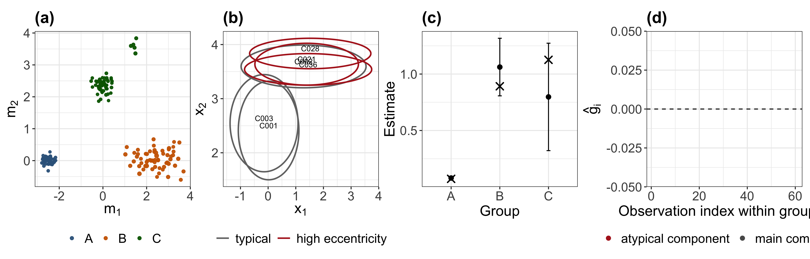
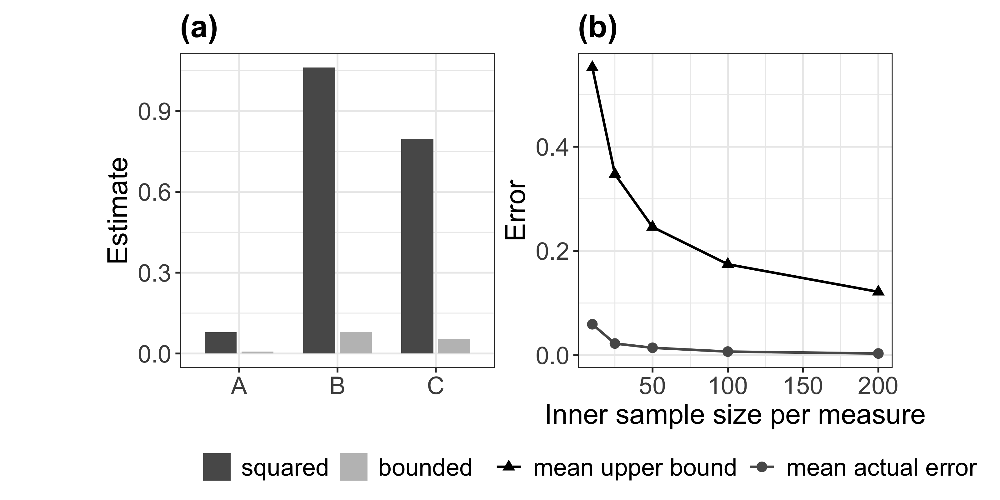

# Example: Synthetic Gaussian Measures
Kisung You

- [Introduction](#introduction)
- [Generate one synthetic data set](#generate-one-synthetic-data-set)
- [Groupwise heterogeneity
  summaries](#groupwise-heterogeneity-summaries)
- [Build the figure objects](#build-the-figure-objects)
- [Overview of one simulated data
  set](#overview-of-one-simulated-data-set)
- [Transform choice and plug-in
  stability](#transform-choice-and-plug-in-stability)
- [Transform comparison](#transform-comparison)
- [Most eccentric observations in group
  C](#most-eccentric-observations-in-group-c)
- [Degenerate comparison example](#degenerate-comparison-example)
- [Remarks](#remarks)

### Introduction

This notebook reproduces the synthetic Gaussian illustration used in the
manuscript. The aim is to generate three groups of probability measures
with distinct heterogeneity structures, compute the proposed quantities
from the pairwise Wasserstein distances, and visualize the resulting
summary and diagnostic figures.

``` r
rm(list = ls())

library(ggplot2)
library(patchwork)

source("src.R")
```

### Generate one synthetic data set

We consider axis-aligned Gaussian measures in two dimensions. Group A is
tightly concentrated, group B is more diffuse, and group C contains a
compact main component together with a separated atypical component.
This creates a simple setting in which both global heterogeneity and
observation-level eccentricity can be examined.

``` r
single <- run_single_dataset_demo(
  seed = 20260307,
  n_A = 60,
  n_B = 60,
  n_C = 60,
  alpha = 0.05,
  top_k = 6,
  make_base_plots = FALSE,
  save_plot_data = TRUE,
  output_dir = NULL
)
```

### Groupwise heterogeneity summaries

We first inspect the estimated within-group heterogeneity under the
squared transform. The table below also includes the analytic target
values available from the data-generating model.

``` r
single$summary_sq
```

      group  n   estimate  sigma2_hat          se   ci_lower   ci_upper true_D_sq
    A     A 60 0.07905304 0.003798687 0.007956849 0.06345791 0.09464818  0.071800
    B     B 60 1.06190451 1.015423633 0.130091227 0.80693039 1.31687863  0.891600
    C     C 60 0.79747148 3.535405654 0.242741483 0.32170692 1.27323604  1.125892
             error   abs_error ci_covers_true
    A  0.007253045 0.007253045           TRUE
    B  0.170304510 0.170304510           TRUE
    C -0.328420520 0.328420520           TRUE

The one-sample large-sample summaries against the benchmark null value
$D_\psi(\Pi)=0$ are as follows.

``` r
single$one_sample_table
```

      group   estimate          se   z_stat      p_value
    A     A 0.07905304 0.007956849 9.935219 2.925310e-23
    B     B 1.06190451 0.130091227 8.162768 3.274329e-16
    C     C 0.79747148 0.242741483 3.285271 1.018844e-03

Pairwise group comparisons under the proposed two-sample approximation
are given next.

``` r
single$pairwise_sq
```

      groupA groupB nA nB  estimateA estimateB  delta_hat        se   ci_lower
    1      A      B 60 60 0.07905304 1.0619045 -0.9828515 0.1303343 -1.2383021
    2      A      C 60 60 0.07905304 0.7974715 -0.7184184 0.2428719 -1.1944385
    3      B      C 60 60 1.06190451 0.7974715  0.2644330 0.2754036 -0.2753482
        ci_upper     z_stat      p_value p_value_adjusted true_delta ci_covers_true
    1 -0.7274009 -7.5410019 4.663742e-14     1.399123e-13  -0.819800           TRUE
    2 -0.2423983 -2.9580143 3.096277e-03     6.192554e-03  -1.054092           TRUE
    3  0.8042142  0.9601654 3.369720e-01     3.369720e-01  -0.234292           TRUE

### Build the figure objects

The manuscript reports two figures. The first summarizes the geometry of
the simulated measures and the resulting heterogeneity estimates. The
second compares the squared and bounded transforms and displays the
plug-in stability bound.

``` r
plots <- make_2d_measure_ggplots(single$plot_data)

p1 <- label_panel(plots$locations, "(a)")
p2 <- label_panel(plots$representative, "(b)")
p3 <- label_panel(plots$summary, "(c)")
p4 <- label_panel(plots$eccentricity, "(d)")

p5 <- label_panel(plots$transform, "(a)")
p6 <- label_panel(plots$plugin, "(b)")

overview_plot  <- p1 | p2 | p3 | p4
secondary_plot <- p5 | p6
```

### Overview of one simulated data set

The first figure summarizes the geometry of the three groups, selected
representative measures from the heterogeneous group, the within-group
heterogeneity estimates with Wald intervals, and the empirical
eccentricities in group C.

``` r
plot(overview_plot)
```



This figure is useful for connecting the global heterogeneity summary to
the local observation-wise diagnostics. In particular, the measures with
the largest empirical eccentricities should align with the atypical
component in group C.

### Transform choice and plug-in stability

The second figure compares the squared transform with the bounded
transform \[ (t)=,\] where $c_0$ is chosen from the sample pairwise
distances, and then examines the plug-in stability bound for the
Lipschitz transform $\psi(t)=t$.

``` r
plot(secondary_plot)
```



The bounded transform should compress the heterogeneity estimates
relative to the squared transform, especially for groups with larger
pairwise distances. The plug-in panel should show that the observed
approximation error decreases as the inner sample size increases and
remains below the theoretical upper bound.

### Transform comparison

For convenience, the table below extracts the groupwise estimates under
the squared and bounded transforms.

``` r
single$transform_table
```

      group    squared     bounded
    1     A 0.07905304 0.006960333
    2     B 1.06190451 0.080098608
    3     C 0.79747148 0.054980349

### Most eccentric observations in group C

The next table records the observations in group C with the largest
empirical eccentricities. These are the measures that contribute most
strongly to the heterogeneity signal within that group.

``` r
single$top_C
```

       obs       ghat rank component         m1       m2        s1        s2
    1 C028 3.89711376    1  atypical  1.5230201 3.834765 1.0960226 0.1407204
    2 C036 3.00699763    2  atypical  1.4463967 3.540783 1.1493287 0.1459358
    3 C021 2.85578452    3  atypical  1.3935387 3.637261 0.9358823 0.1932082
    4 C053 2.77179937    4  atypical  1.4875322 3.359783 1.1762401 0.1788454
    5 C002 2.67332475    5  atypical  1.2831034 3.596101 1.1293778 0.1974698
    6 C043 0.05995365    6      main -0.1929343 1.862910 0.5378206 0.3459960

The proportion of the top-ranked eccentric observations belonging to the
atypical component is

``` r
single$prop_atypical_topC
```

    [1] 0.8333333

### Degenerate comparison example

The following object corresponds to the balanced two-point construction
used to illustrate a configuration in which the heterogeneity target is
positive but the first-order projection variance can be small or
degenerate.

``` r
single$degenerate_table
```

      estimate   sigma2_hat           se
    1 4.576271 1.158422e-27 4.393977e-15

### Remarks

This synthetic example serves three purposes. First, it verifies that
the heterogeneity estimator and its standard error behave as expected in
a setting with closed-form Wasserstein geometry. Second, it shows that
the empirical eccentricities recover the observations responsible for
the additional heterogeneity in the mixture group. Third, it illustrates
the intended effects of changing the transform and of replacing the
ideal measures by plug-in approximations.
